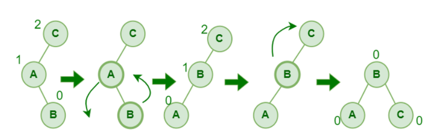

# BST

case 1: cut it from parent and remove

case 2: parent with one child

case 3: parent with sub tree

# AVL

1. Self balancing tree
2. insertion in BST form but it keeps it balanced
3. balance factor: height of left subtree - height of right subtree
4. 
5. due to balance factor height of tree remains in control causing faster access.
6. AVL is nearly balanced means +1,0,-1 balance factor

# AVL insertion

1. insert one node at a time using bst
2. after every insertion calculate balance factor and stop at 1st un-balanced point
3. plot 3 node path from unbalanced to newly inserted node
4. see and apply rotation

# AVL Rotation

1. left of left
2. 

3. right of right
4. 

5. right of left
6. 

7. left of right
8. 

# Splay (buffering/cache system)

1. left(zig)
2. right(zag)
3. zig-zig
4. zag-zag
5. zig-zag

# Multiway Search Tree

1. a node can have n elements
2. as computer grew with hardware and software one can store multiole elements in a node
3. multiple elements in a node
4. examples: B/B+ tree, 2-3 tree, 2-3-4 tree, red-black tree

# B/B+ tree

1. B-tree has order, M,M must be odd only, M decides Max, Min,Spilt
2. 
3. insertion in leaf only
4. leaf splits and creates parent
5. parent splits and creates grand parent
6. B: slow in sequential access due to nature of data being being stores in scattered manner
7. B+: fast in sequential access due to nature of data being being stores in scattered manner
8. similar to B but in this data is only stored in leaf and all leaf nides are connected to each other

# Graph and Tree

1. weight : Any unit that can be used to take decision...
2. ex: cost ot travel, distance, delay, bandwidth, queue, length, time, etc
3. path
4. cycle
5. adjacent node

## Terminology
1. The degree of a vertex is the number of edges incident to it.

# DFS

1. accpet graph and innit stack and accept source node
2. mark source as visited and push on stack
3. while stack is not empty do
   - search anyone unvisited neighbour of element at tos
   - mark if visited and psuh on stack
4. if not visited found pop and continue

# BFS
1. accept graph source and init queue
2. mark source as visited and push on queue
3. while queue is not empty do
   - search anyone unvisited neighbour of element at front
   - mark if visited and push on queue
   - pop from queue

# Tree implementation

1. Static(Array)
   - root at 0
   - for each ith node
   - 2i+1: Left child
   - 2I+2: Right child
   - +ve: simple, fast
   - -ve: fixed size, wastage of space
   - Disadvantage: wastage of space, cannot grow

2. Dynamic (Doubly Linked List)
   - use DLL node to create Linked List
   - +ve: dynamic, no wastage of space, on demand basis
   - -ve: slow, complex, one can only traverse from top to bottom and not vice versa

3. Dynamic (Tree Node)
   - node can refer left and right child and parent, 3 way bond or between parent and child 2 way bond
   - +ve: non-recursive code can be used to traverse
   - -ve: complex, slow, one can only traverse from top to bottom and not vice versa